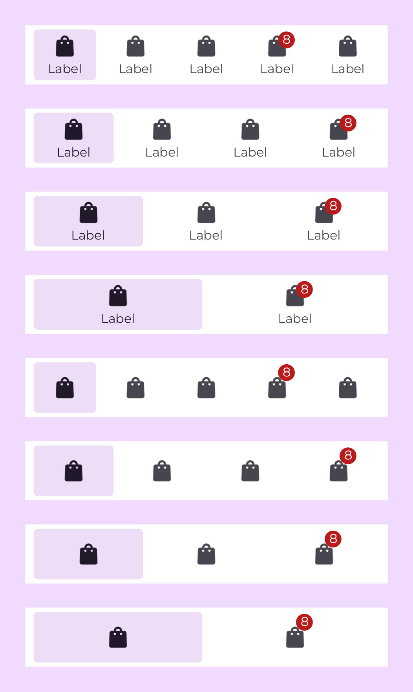

<h1>BottomTabBar</h1>

# BottomTabBar

<div>
  
</div>
<br>

## Usage

```kotlin
BottomTabBar(
    modifier = Modifier,
    tabs = listOf(
        TabBarButtonData(
            id = 1,
            icon = painterResource(id = R.drawable.ic_bag),
            text = text,
        ),
        TabBarButtonData(
            id = 2,
            icon = painterResource(id = R.drawable.ic_bag),
            text = text,
            count = 8,
        ),
    ),
    activeTabIndex = 0,
    onButtonClick = {},
)
```

## Parameters

| Property          | Type                     | Default                      | Description                                     |
|-------------------|--------------------------|------------------------------|-------------------------------------------------|
| modifier          | `Modifier`               | Modifier                     | Модификатор                                     |
| backgroundColor   | `Color`                  | AppTheme.colors.bottomNavBar | Цвет фона нижней панели навигации               |
| tabs              | `List<TabBarButtonData>` | emptyList()                  | Список данных для отображения ячеек             |
| activeTabIndex    | `Int`                    |                              | Индекс ячейки которая будет подсвечена активной |
| onButtonClick     | `Callback`               |                              | Колбек клика по табу                            |

<br/>
