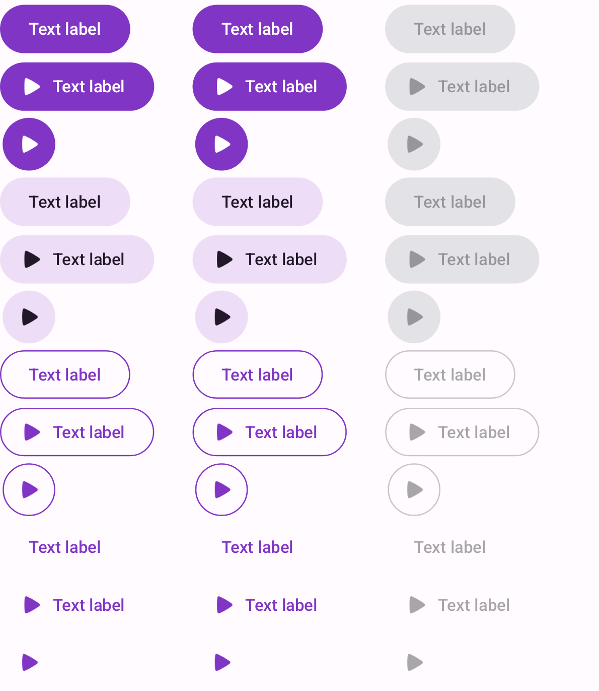

<h1>Buttons</h1>

# DefaultButton

<div>
  
</div>
<br>

## Usage

```kotlin
DefaultButton(
    enabled = true,
    onClick = {

    },
    style = DefaultButtonStyle.Filled,
    icon = painterResource(id = R.drawable.icon_image),
    text = "Text label",
)
```

## Parameters

| Property          | Type                   | Default    | Description                                        |
|-------------------|------------------------|------------|----------------------------------------------------|
| modifier          | `Modifier`             | Modifier   | Модификатор                                        |
| enabled           | `Boolean`              | true       | Доступность взаимодействиия с компонентом          |
| onClick           | `Callback`             | Unit       |                                                    |
| debounceClicks    | `Boolean`              | true       | включение защиты от множественных кликов по кнопке |
| interactionSource | `WindowInsets`         | systemBars |                                                    |
| style             | `DefaultButtonStyle`   |            |                                                    |
| icon              | `Painter`              | null       |                                                    |
| text              | `String`               | null       |                                                    |

<br/>
