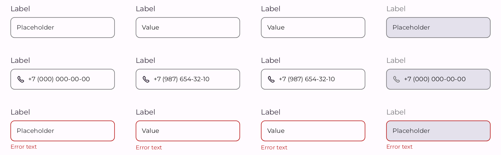

<h1>Inputs</h1>

# Input

<div>
  
</div>
<br>

## Usage

```kotlin
InputField(
    modifier = Modifier,
    value = "",
    onValueChange {},
    label = "Label",
    placeholder = "Placeholder",
    description = "Description",
    enabled = true,
    error = null,
    success = null,
    readOnly = false,
    singleLine = true,
    leadingIcon = null,
    trailingIcon = null,
    colors = TextFieldDefaults.colors(),
    textStyle = AppTheme.typography.label.medium,
)
```

## Parameters

| Property      | Type              | Default                           | Description                              |
|---------------|-------------------|-----------------------------------|------------------------------------------|
| modifier      | `Modifier`        | Modifier                          | Модификатор                              |
| value         | `String`          | ""                                | значение в поле ввода                    |
| onValueChange | `Callback`        | {}                                | колбек при изменении значения поля ввода |
| label         | `String?`         | null                              | лейбл                                    |
| placeholder   | `String?`         | null                              | плейсхолдер                              |
| description   | `String?`         | null                              | описание                                 |
| enabled       | `Boolean`         | true                              | доступность элемента                     |
| error         | `String?`         | null                              | описание ошибки                          |
| success       | `String?`         | null                              | описание успеха                          |
| readOnly      | `Boolean`         | false                             | только для чтения                        |
| singleLine    | `Boolean`         | false                             | поле ввода в одну линию                  |
| leadingIcon   | `Composable`      | @Composable (() -> Unit)? = null  |                                          |
| trailingIcon  | `Composable`      | @Composable (() -> Unit)? = null  |                                          |
| colors        | `TextFieldColors` | TextFieldDefaults.colors()        |                                          |
| textStyle     | `TextStyle`       | AppTheme.typography.label.medium  |                                          |

<br/>
