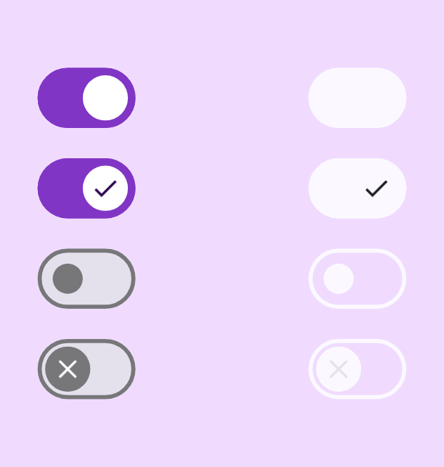

<h1>Switch</h1>

# Switch

<div>
  
</div>
<br>

## Usage

```kotlin
Switch(
    modifier = modifier,
    checked = true,
    onCheckedChange = onCheckedChange,
    enabled = true,
    colors = SwitchDefaults.colors(),
)
```

## Parameters

| Property          | Type                       | Default    | Description                                  |
|-------------------|----------------------------|------------|----------------------------------------------|
| modifier          | `Modifier`                 | Modifier   | Модификатор                                  |
| checked           | `Boolean`                  |            | Флаг включен ли свич                         |
| onCheckedChange   | `Callback`                 | Unit       | Колбек при переключении свича                |
| thumbContent      | `Composable`               | true       | Контент для отображения внутри переключателя |
| enabled           | `Boolean`                  | systemBars | Флаг доступности элемента                    |
| colors            | `SwitchColors`             |            | Цвета свича                                  |
| interactionSource | `MutableInteractionSource` | null       |                                              |

<br/>
